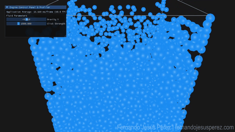

# Fluid Simulation ECS

A real-time 3D fluid simulation built from scratch in modern C++20, combining a **Data-Oriented / ECS architecture** (using [EnTT](https://github.com/skypjack/entt)) with a **GPU-accelerated SPH solver** written in GLSL compute shaders.

> Simulates 5,000+ particles at interactive framerates by moving the entire physics pass — neighbor search, density/pressure, forces, integration and collisions — onto the GPU.



---

## Overview

This project implements **Smoothed Particle Hydrodynamics (SPH)**, the same class of method used in physically-based fluid solvers, to simulate a real-time, interactive body of fluid inside a bounded 3D box. It started as a CPU-side simulation built around an ECS registry, then evolved into a GPU compute pipeline once the particle count made the CPU neighbor search the clear bottleneck — both implementations are still present in the codebase (see [Architecture](#architecture)) as a record of that optimization path.

The simulation responds to real-time user input: you can tilt gravity to slosh the fluid around the container, or click-and-drag to attract/repel particles directly.

## Technical Highlights

- **GPU compute pipeline (GLSL 4.3, two-pass SPH):**
  - **Pass 0** — computes per-particle density and pressure using the Poly6 smoothing kernel.
  - **Pass 1** — computes pressure (Spiky gradient) and viscosity (Laplacian) forces, integrates velocity/position, and resolves collisions against the bounding box — all in a single dispatch.
- **GPU spatial hashing:** a uniform grid (28×28×28 cells) is rebuilt every frame directly on the GPU (`GridBuilder.comp`) using atomic counters to bucket particles per cell, turning an O(n²) neighbor search into a bounded, local lookup.
- **Data-Oriented particle layout:** particles are packed into a `std430`-aligned `GPUParticle` struct (position/velocity/properties) and pushed to a Shader Storage Buffer Object (SSBO), so the GPU reads and writes the simulation state directly with no per-frame CPU round-trip.
- **ECS-driven scene management (EnTT):** particle spawning and CPU-side bookkeeping go through an ECS registry (`Position`, `Velocity`, `FluidProperties` components), keeping simulation *data* decoupled from simulation *logic*.
- **CPU reference implementation retained:** the original CPU solver (spatial hash grid + SPH forces, `Systems.h`) is kept alongside the GPU path — useful as a readable reference for the math, and as a benchmark for the GPU speedup.
- **Interactive controls:** real-time gravity tilting, mouse-driven attraction/repulsion, and a live ImGui panel for tuning gravity and interaction strength while the simulation runs.

## Architecture

```
src/
├── Core/         # Engine loop, window/input handling, camera, ImGui panel
├── ECS/          # EnTT components, CPU/GPU simulation systems, compute shaders (.comp)
├── Physics/      # CPU spatial hash grid (legacy path)
├── Render/       # Instanced particle renderer + GLSL vertex/fragment shaders
└── main.cpp
```

- **`Core/Engine`** owns the GLFW window, the EnTT registry, the orbital camera, and drives the frame loop (input → simulation update → render → UI).
- **`ECS/Systems.h`** contains both simulation paths: the original CPU functions (`UpdateDensityAndPressure`, `ApplyForces`, `IntegratePositions`) and the current GPU path (`UpdateFluidSimulationGPU`), which dispatches `GridBuilder.comp` and `FluidSimulation.comp`.
- **`Render/Renderer`** draws particles as camera-facing billboarded quads via instancing, plus a wireframe box for the simulation bounds.

## Build & Run

Dependencies are fetched automatically via CMake `FetchContent` — no manual setup required.

```bash
git clone https://github.com/fertico4/FluidSimulationECS.git
cd FluidSimulationECS
cmake -B build
cmake --build build --config Release
```

**Requirements:**
- C++20 compiler
- OpenGL 4.3 core profile (OpenGL 4.1 on macOS)
- CMake ≥ 3.24

Dependencies fetched automatically: [Dear ImGui](https://github.com/ocornut/imgui), [GLM](https://github.com/g-truc/glm), [GLFW](https://github.com/glfw/glfw), [EnTT](https://github.com/skypjack/entt), [GLAD](https://github.com/Dav1dde/glad).

## Controls

| Input | Action |
|---|---|
| `W A S D` / Arrow keys | Tilt gravity to slosh the fluid |
| `Space` | Reset gravity to default (straight down) |
| Right-click + drag | Attract / push particles at the cursor |
| Left-click + drag | Orbit camera |
| Scroll | Zoom camera |
| `Esc` | Quit |

The ImGui panel (top-left) exposes live sliders for **Gravity Y** and **Click Strength**, plus a frame-time profiler.

## Roadmap

- [ ] Surface reconstruction (marching cubes) for a proper fluid mesh instead of particle billboards
- [ ] Benchmark comparison: CPU path vs GPU path at increasing particle counts

---

Built by [Fernando Jesús Pérez](https://fernandojesusperez.com) — Physics, Graphics & Tools Programmer.

---

## Copyright & License

© Fernando Jesús Pérez. All rights reserved.

This repository and its source code are published for portfolio, educational and code-review purposes only. Redistribution, commercial use or modification of the code without prior permission is not permitted.